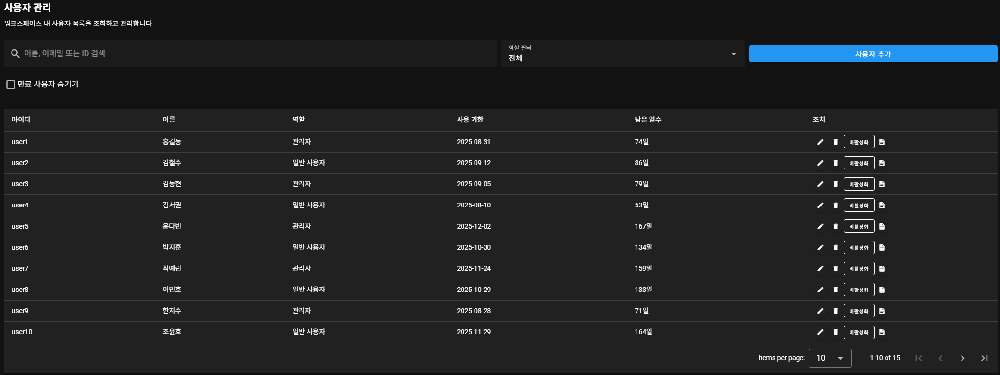
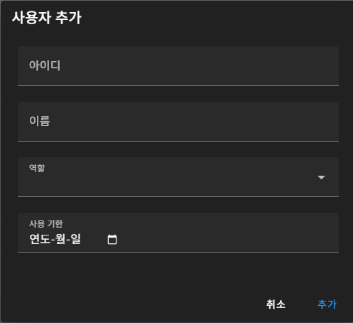
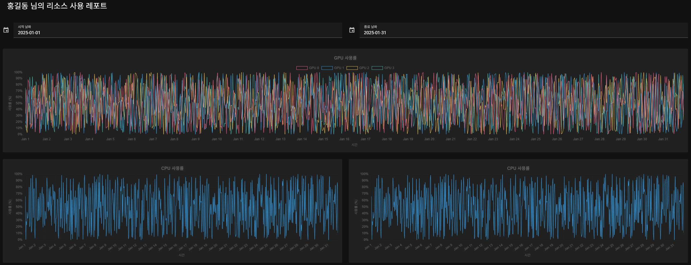

# 4. 사용자 관리 및 리소스 보고 시스템

사용자 정보와 리소스(CPU, GPU, MEM) 사용량을 관리하고 시각화합니다.

## 4.1 관련 파일 구성
```
src/
├── components
│   └── user
│       ├── CPU_CHART.vue
│       ├── GPU_CHART.vue
│       └── MEM_CHART.vue
├── pages
    ├── users.vue
    └── userReport.vue
```

## 4.2 `users.vue`



### 기능 설명:
- 사용자 목록을 테이블 형태로 렌더링합니다.
- 이름, 역할, 사용 기한, 남은 일수 정보를 표시합니다.
- 사용자 추가/삭제/수정 기능과 리포트 보기 버튼을 제공합니다.

### 주요 데이터 바인딩 
- `users`: API에서 받아온 사용자 목록
- `dialog`: 사용자 추가 폼 다이얼로그 상태
- `reportDialog`: 사용자 리포트 페이지로 이동

### API 예시
```http
GET /api/users
POST /api/users
DELETE /api/users/<id>
```

### JSON 형식
```json
{
  "id": "user1",
  "name": "홍길동",
  "role": "관리자",
  "expiry": "2025-12-31",
  "active": true
}
```

---

## 4.3 `userReport.vue`



### 기능 설명:
- 선택된 사용자의 리소스 사용량(GPU/CPU/MEM)을 시각화하여 보여줍니다.
- 시작일과 종료일을 설정해 필터링할 수 있습니다.
- Chart.js를 기반으로 한 라인 그래프로 일별 리소스 사용량을 시각화합니다.

### 주요 데이터 바인딩 
- `user`: 리포트 대상 사용자 정보
- `startDate`, `endDate`: 리포트 기간 필터
- `cpuData`, `gpuData`, `memData`: 각각의 사용량 배열

### JSON 형식
```json
{
  "usageTimestamps": ["2025-01-01", "..."],
  "cpuUsage": [40, 50, ...],
  "gpuUsage": [[10,20,30,40], ...],
  "memUsage": [60, 70, ...]
}
```

---

## 4.4 전체 흐름 요약

1. `users.vue`에서 사용자 목록을 로딩하고 목록에서 리포트를 선택하면
2. `userReport.vue`로 이동하여 선택된 사용자의 기간별 리소스 사용률을 조회합니다.
3. 각각의 자원은 Chart.js 기반의 라인 차트로 표현되며 필터 적용 가능
