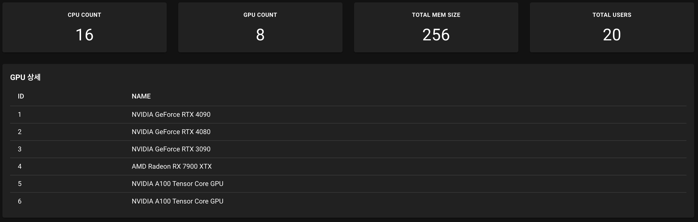
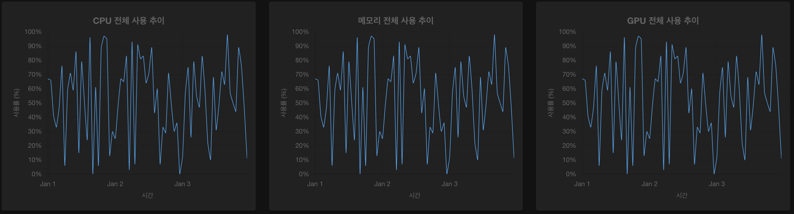
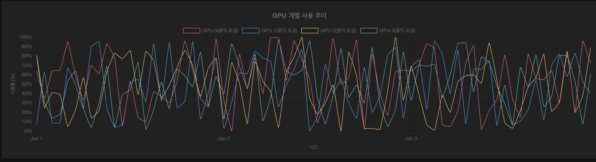
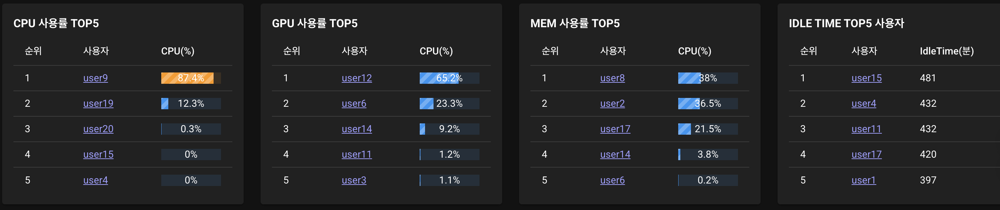

# 6. 보고서 구성 및 컴포넌트

`/reports.vue` 와 `/components/reports/*.vue` 는 GPU/CPU/Memory 자원의 전체/개별 사용량, 어떤 사용자에게 할당되었는지, 시간대 변경별 사용 추이를 보여주기 위해 다양한 차트 형식으로 시각화합니다.


## 6.1 관련 파일 구성
```
src
├── components
│   └── common
│       ├── MULTI_CHART_GPU.vue
│       ├── SINGLE_CHART_CPU.vue
│       ├── MULTI_CHART_TEMP.vue
│       ├── SINGLE_CHART_GPU.vue
│       ├── SINGLE_CHART_MEM.vue
│       ├── SIMPLE_CPU_COUNT.vue
│       ├── SIMPLE_GPU_COUNT.vue
│       ├── TotalUsageCharts.vue
│       ├── SIMPLE_TOTAL_MEM.vue
│       ├── TSIMPLE_TOTAL_USER.vue
│       ├── USAGE_RANK_CPU.vue
│       ├── USAGE_RANK_GPU.vue
│       ├── USAGE_RANK_MEM.vue
│       ├── USAGE_RANK_IDLE.vue
│       ├── SIMPLE_GPU_DETAILS.vue
└── pages
    └── reports.vue
```


## 6.2 SystemInfoCards.vue



- 카드 별 내용: 유저수, GPU 갯수, CPU, 메모리
- GPU 정보
- 사용된 구성요소: `<v-row>`, `<v-col>`, `<v-card>`
- 각 항목은 별도의 `<v-card>`로 구성되어 재사용 용이

```
```


## 6.3 TotalUsageCharts.vue



- GPU/CPU/Memory 자원의 전체 사용량을 날짜별로 선형 차트로 시각화
- Tooltip에 사용 개수와 전체 대비 퍼센트(%)까지 표시
- 선택된 기간에 따라 그래프가 자동 갱신됨
- Chart.js 사용 (LineChart.vue 내부 구성)

```
```

## 6.4 IndividualCharts.vue - GPU 온도

**단일 선택**



- GPU 선택 목록으로 1개 또는 다수 GPU의 온도를 날짜별 라인차트로 표시
- Tooltip에 GPU 이름 + 온도 표시

- GPU 선택은 토글로 여러개를 다중으로 띄우는게 가능

```
```

## 6.5 UserRankTables.vue



- 누적 GPU/CPU/Memory 사용량 합계 Top 5 사용자 테이블
- 유휴 시간 (자원 미사용 일수) 기준 Top 5 테이블
- API: `/api/report/rank` 로부터 랭킹 데이터 로드
- 각 사용자 클릭 시 `/report/user/이름` 페이지로 이동하도록 구성됨
- `v-table`로 구성되어 데이터 정렬/확장에 용이

```
```

## 6.6 reports.vue - 날짜 필터 영역


- 상단에 위치한 날짜 선택 UI
- `selectedStartDate`, `selectedEndDate` 값에 따라 모든 하위 컴포넌트에 연동
- `watch([selectedStartDate, selectedEndDate], fetchAll)`로 변경 감지하여 API 재호출
- 사용 라이브러리: `<v-date-picker>` (Vuetify)

```
```

모든 API는 `/api/report/*` 형태로 연결되며, 보고서 갱신 주체는 `fetchAll()` 함수입니다.  
해당 함수는 `onMounted` 시 초기 호출되며, 이후 날짜 변경 등으로 자동 재갱신됩니다.

```